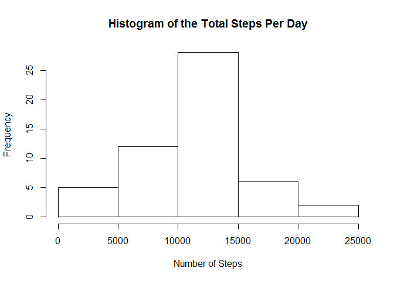
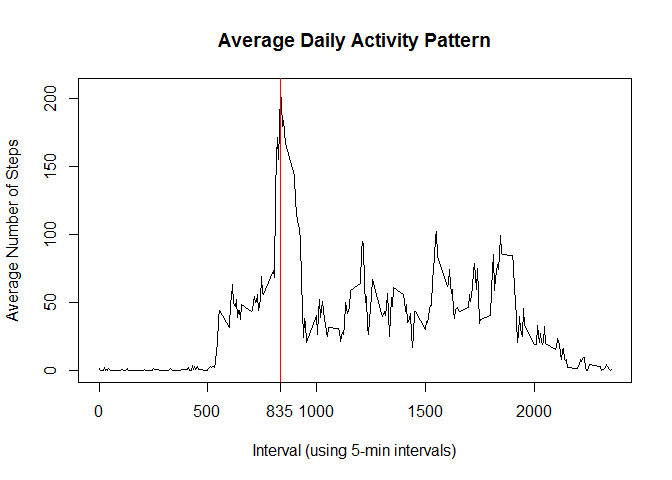
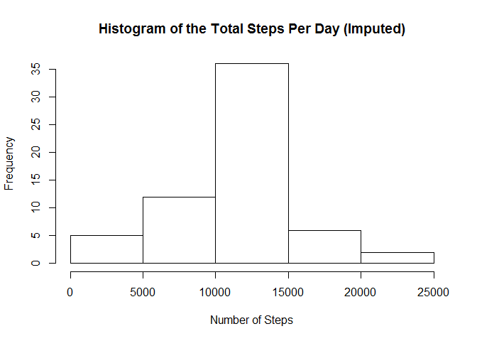
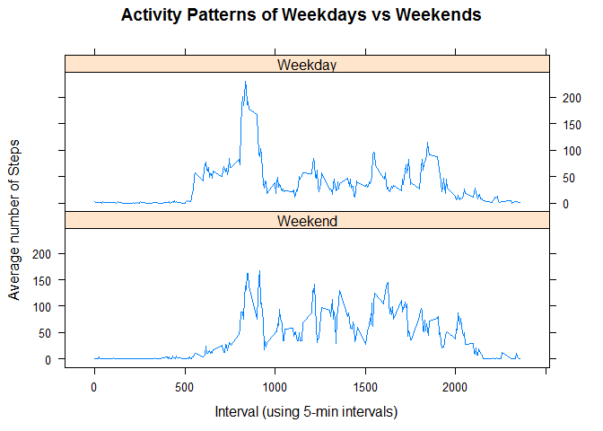

# Reproducible Research: Peer Assessment 1


## Loading and preprocessing the data

```r
        if(!file.exists("activity.csv")) {
                if(!file.exists("activity.zip")) {
                     download.file("https://d396qusza40orc.cloudfront.net/repdata%2Fdata%2Factivity.zip",
                              "activity.zip")
                }
                unzip("activity.zip")
        }
        colClasses <- c("numeric","Date", "numeric")
        activitydata <- read.csv("activity.csv", colClasses = colClasses)
```


## What is mean total number of steps taken per day?


```r
        nadata <- is.na(activitydata$steps) 
        stepdata <- activitydata[!nadata,]
        #stepdata$date <- as.Date(as.character(stepdata$date), "%Y-%m-%d")
        daytotal <- aggregate(steps ~ date, stepdata, sum)
```
* The mean total number of steps are 

```r
        mean(daytotal$steps)
```

```
## [1] 10766.19
```
* The median is 

```r
        median(daytotal$steps)
```

```
## [1] 10765
```
* The histogram of the Total Steps per Day reflects these values.

```r
        hist(daytotal$steps, main = "Histogram of the Total Steps Per Day",
     xlab = "Number of Steps")
```



## What is the average daily activity pattern?


```r
        stepintervalmean <- aggregate(steps ~ interval, stepdata, mean)
with(stepintervalmean, plot(interval, steps, type = "l", 
                            xlab = "Interval (using 5-min intervals)", 
                            ylab = "Average Number of Steps"))
title(main = "Average Daily Activity Pattern")

        maxSteps <-  max(stepintervalmean$steps)
        maxInterval <- stepintervalmean[ stepintervalmean$steps ==
                                                 maxSteps,]$interval
        abline(v=maxInterval, col = "red")
        axis(1, at=maxInterval, label=maxInterval)
```


  
* The interval with the highest number of steps is located on the x axis at:

```r
        maxInterval
```

```
## [1] 835
```
* At this interval the number of steps are:

```r
        maxSteps
```

```
## [1] 206.1698
```

## Imputing missing values

### Approach  
* The NA values are imputed by taking the mean of the steps per day, calculated  
in the previous analysis. Then, replacing each NA with the corresponding  
calculated interval value.    


```r
        #Find all activity where steps are NA
        actna <- activitydata[nadata,]
        imputactivity <- activitydata
        imputmean <- lapply(imputactivity[nadata,]['interval'], 
                    FUN = function(x) 
                            stepintervalmean[ stepintervalmean['interval'] == 
                                                      x,][c('interval','steps')])
#Build data frame of mean with original structure
actna_dates <- unique(actna$date)
df <- data.frame(imputmean)
names(df) <- c("interval", "steps")
nadates <- activitydata[nadata,]$date
naintrcol <- rep(df[,c(1)], length(actna_dates))
nastepcol <- rep(df[,c(2)], length(actna_dates))
dfna <- data.frame( date=nadates, steps=nastepcol, interval=naintrcol)
imputactivity[nadata,]$steps <- dfna$steps

impdaytotal <- aggregate(steps ~ date, imputactivity, sum)
hist(impdaytotal$steps, main = "Histogram of the Total Steps Per Day (Imputed)",
     xlab = "Number of Steps")
```


  
* The imputed mean total number of steps are 

```r
        mean(impdaytotal$steps)
```

```
## [1] 10766.19
```
* The imputed median is 

```r
        median(impdaytotal$steps)
```

```
## [1] 10766.19
```


## Are there differences in activity patterns between weekdays and weekends?
  
Yes,the graphs below show the differences between the activity on a weekday and  
weekend.  


```r
#Create factor varible for the weekdays and weekends
library(lattice)
weekday <- c('Monday', 'Tuesday', 'Wednesday', 'Thursday', 'Friday')
weektype <- factor((weekdays(imputactivity$date) %in% weekday), 
                   levels=c(FALSE, TRUE), labels=c('Weekend', 'Weekday'))

impintervalmean <- aggregate(steps ~ interval + weektype, imputactivity, mean)

with( impintervalmean, xyplot(steps ~ interval | weektype, type ="l", 
                         layout = c(1,2),
                         main = "Activity Patterns of Weekdays vs Weekends",
                         ylab = "Average number of Steps",
                         xlab = "Interval (using 5-min intervals)"))
```




